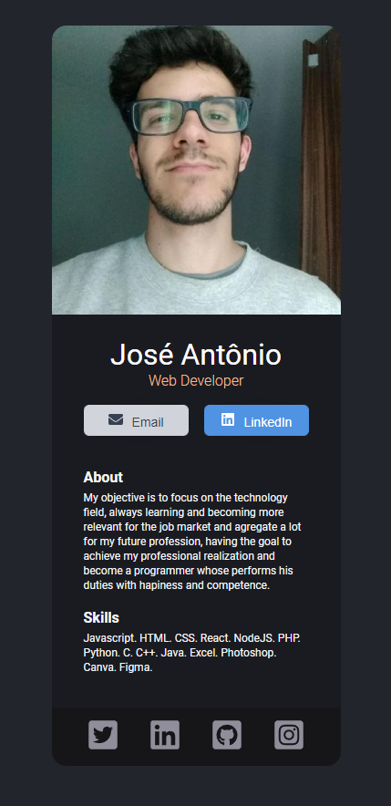

# Digital Business Card 🗃️

This project is a solution to the first module of a React course on [Scrimba](https://scrimba.com/). Scrimba is an online platform where you can improve your skills by creating real projects!

### Check it out by yourself!
[Click Here](https://gleeful-tartufo-49b090.netlify.app/) to go to the card page!

#### Screenshot 💻

## Available Scripts

In the project directory, you can run:

### `npm start`

Runs the app in the development mode.\
Open [http://localhost:3000](http://localhost:3000) to view it in your browser.

The page will reload when you make changes.\
You may also see any lint errors in the console.

##### Built using:
- ReactJS
- React-Icons
- HTML/CSS
